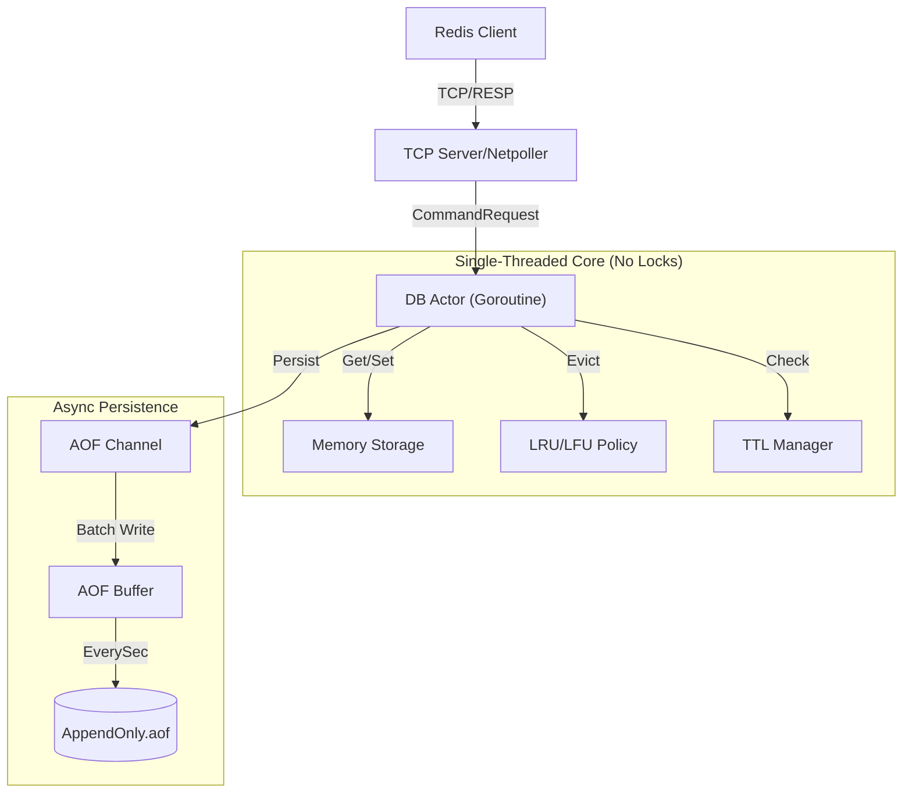

# MyRedis - Go 语言实现的高性能 Redis 兼容服务器 🚀


MyRedis 是一个基于 Go 语言 (1.21+) 自主研发的轻量级、高性能分布式 KV 存储引擎。它旨在通过**单线程 Actor 模型**复刻 Redis 的核心特性，彻底解决并发编程中的锁竞争痛点，同时提供工业级的持久化与内存管理能力。

---

## ✨ 核心特性 (Features)

*   **完全兼容 RESP 协议**：支持 Redis 客户端（`redis-cli`, `go-redis` 等）无缝连接，支持 Pipeline 批量请求。
*   **无锁架构 (Lock-Free)**：采用 **Single-Threaded Actor Model**，通过 Go Channel 串行化请求，消除 `sync.RWMutex` 锁竞争，实现极高吞吐。
*   **多数据结构**：支持 **String**, **List**, **Hash**, **Set** 四大核心数据类型。
*   **持久化保障**：实现 **AOF (Append Only File)** 持久化，支持 `EverySec` (每秒刷盘) 策略，确保数据安全，支持服务器优雅关闭与重启恢复。
*   **智能内存管理**：
    *   **TTL 过期**：支持 `EXPIRE`, `TTL`, `PERSIST` 命令，采用**惰性删除 + 定期删除**双重策略。
    *   **内存淘汰**：集成 **LRU (Least Recently Used)** 与 **LFU (Least Frequently Used)** 算法，防止内存溢出 (OOM)。

---

## 🏗️ 系统架构 (Architecture)

MyRedis 采用经典的 Reactor 网络模型 + Actor 业务模型：



---

## 🚀 快速开始 (Getting Started)

### 前置要求
*   Go 1.21+
*   Windows/Linux/MacOS

### 安装与运行

1.  **克隆项目**
    ```bash
    git clone https://github.com/yourusername/myredis.git
    cd myredis
    ```

2.  **运行服务器**
    ```bash
    go run cmd/main.go
    # 服务器将监听 :6399 端口
    ```

3.  **使用客户端连接**
    你可以使用官方 `redis-cli` 或任何兼容 Redis 的客户端：
    ```bash
    redis-cli -p 6399
    
    127.0.0.1:6399> SET name myredis
    OK
    127.0.0.1:6399> GET name
    "myredis"
    127.0.0.1:6399> LPUSH mylist a b c
    (integer) 3
    127.0.0.1:6399> LRANGE mylist 0 -1
    1) "c"
    2) "b"
    3) "a"
    ```

---

## 📊 性能压测 (Benchmark)

我们在 **Windows (WSL2)** 环境下使用 `redis-benchmark` 进行了压力测试（100,000 请求，50 并发）：

| 命令 | QPS (Requests/sec) | 平均延迟 (Avg Latency) |
| :--- | :--- | :--- |
| **SET** | **28,000+** | **1.8 ms** |
| **GET** | **26,500+** | **1.8 ms** |

> **注**：开启 AOF 持久化 (EverySec) 后，性能损耗 **< 5%**，证明了异步 IO 设计的高效性。

---

## 📂 项目结构

```
myredis/
├── cmd/            # 入口文件 (main.go)
├── server/         # TCP Server & Handler
├── resp/           # RESP 协议解析器
├── db/             # 核心数据库实现
│   ├── basic.go    # String 命令
│   ├── list.go     # List 命令
│   ├── hash.go     # Hash 命令
│   ├── set.go      # Set 命令
│   ├── ttl.go      # 过期时间管理
│   └── db.go       # Actor 模型主循环
└── aof/            # AOF 持久化模块
```

## 📝 支持命令列表

| 模块 | 命令 |
| :--- | :--- |
| **String** | SET, GET, DEL, PING |
| **List** | LPUSH, RPUSH, LPOP, RPOP, LRANGE, LLEN |
| **Hash** | HSET, HGET, HGETALL, HDEL |
| **Set** | SADD, SREM, SCARD, SMEMBERS |
| **Keys** | EXPIRE, TTL, PERSIST |

---

## 📄 License
MIT License
